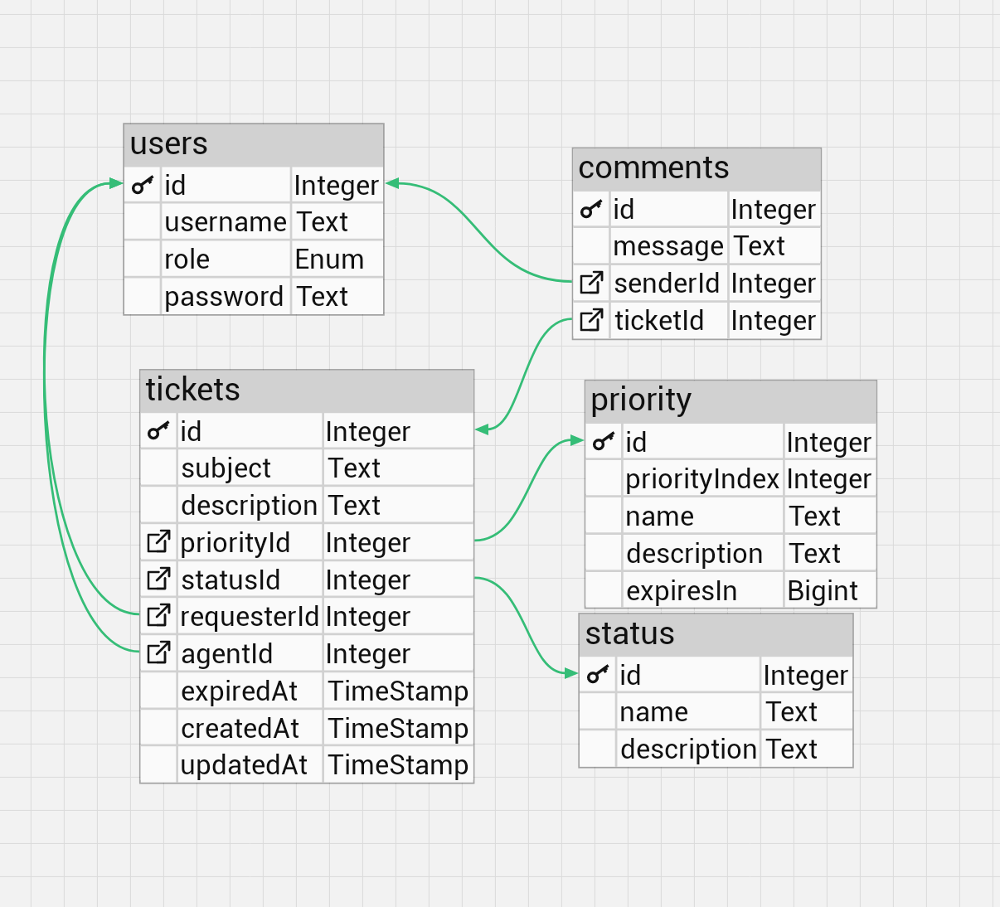

# Structure
## Database schema

## Priority
| id| name | description | expiresIn | priorityIndex|
|-|-|-|-|-|
| 1 | Low |-|-|1|
| 2 | Medium |-|-|2|
| 3 | High |-|-|3|
| 4 | One hour |-| 3600000 |6|
| 5 | One day |-| 86400000 |5|
| 6 | one week |-| 604800000 |4|
## Status
| id| name | description | 
|-|-|-|
| 1 | Unassigned |-|
| 2 | Waiting |-|
| 3 | On progress |-|
| 4 | Resolved |-|
| 5 | Cancelled |-|
| 6 | Overdue |-|
## Role
```
enum Role{
  ADMIN
  AGENT
  CUSTOMER
}
```

# API

## auth
### POST auth/register
```ts
{
  username: string,
  password: string,
  role?: Role //Only ADMIN can change, Default: "CUSTOMER"
}
```
### POST auth/login
```ts
{
  username: string,
  password: string,
}
```

## ticket  (🔒LOGIN REQUIRED)
### GET ticket
```url
ticket?
  sort= newest | priority | expiration &
  subject=string &
  description=string &
  ... //User can input more available column inside the ticket table to filter it
```
- If user is ADMIN, return all ticket
- If user is AGENT, return all assigned ticket
- If user is CUSTOMER, return all requested ticket
### GET ticket/:id
### POST ticket
```ts
{
  subject: string,
  description: string,
  priorityId: number,
  agentId?:number, //ADMIN ONLY, Default: null
  statusId?: number, //ADMIN ONLY, Default: "Unassigned" 
  expiredAt?: timestamp //Default: Date.now()+priority.expiresIn
}
```
### PATCH ticket/:id
```ts
{
  subject?: string, //ADMIN & requester ONLY
  description?: string, //ADMIN & requester ONLY
  priorityId?: number, //ADMIN only
  agentId?:number, //ADMIN ONLY
  statusId?: number, //ADMIN & assigned agent  ONLY
  expiredAt?: timestamp //ADMIN ONLY
}
```
### DELETE ticket/:id
### GET ticket/:ticketId/assign/:agentId
Automatically update the ticket agentId and change it's status to "waiting"
### GET ticket/:ticketId/update/:statusId
> ADMIN and assigned agent only

Update a ticket's status

## comment (🔒LOGIN REQUIRED)
### GET comment/:id
> ADMIN and comment sender only

Return a comment and it's property
### GET comment/ticket/:ticketId
> ADMIN, ticket requester, and assigned agent only

Return all comment inside a ticket
### POST comment/ticket/:ticketId
```ts
{
  message: string
}

```
### DELETE comment/:id
> ADMIN and comment sender only


## user (🔒LOGIN REQUIRED)
### GET user/self
Return logged user info
### GET user
> ADMIN only

Return all user
### GET user/:role
> ADMIN only

Return all user by role
### GET use/:userId/promote/:newRole
> ADMIN only

Update a user's role to newRole
